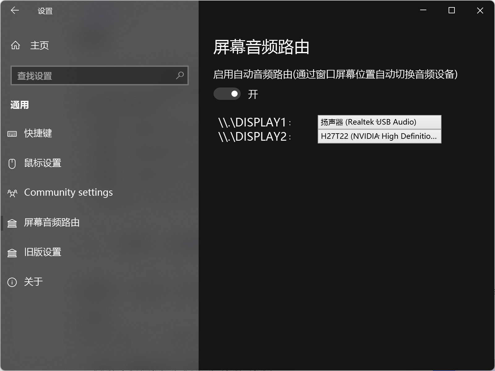

# Screen Audio Router (in EarTrumpet)

## Overview
This is an intrusive modified version of [EarTrumpet](https://github.com/File-New-Project/EarTrumpet) (a popular Windows audio volume controller). 

The core additional feature is **Screen Audio Router**, which realizes automatic audio device switching with window cross-screen movement.

## Core Features
### 1. Original EarTrumpet Features (Retained)
- Lightweight Windows audio control tool
- Per-app volume control and audio device selection
- System tray integration and quick operation
- ... (briefly list core original functions, or directly link to original README)

### 2. New Added Feature: Screen Audio Router
Automatically switches to the audio device configured for the corresponding display when a window is moved across screens.

## Usage
Configure the audio device corresponding to each display in the Screen Audio Router settings within the settings panel.

## Known Issues

> - When switching audio, it does not switch the specified audio stream exclusively, but rather all processes under the entire program name. In other words, if you have two Google Chrome windows (Window A and Window B), dragging only Window B to Display 2 will cause the audio of Window A to also switch to Display 2 along with it.
>
> - When directly opening a window on Display 2, the audio will not automatically switch to the audio device of Display 2.

## License
This project inherits the MIT license of the original EarTrumpet project. For details, please refer to the [LICENSE](LICENSE) file.

## Reference
- Original EarTrumpet README: [EarTrumpet README.md](EarTrumpet_README.md)